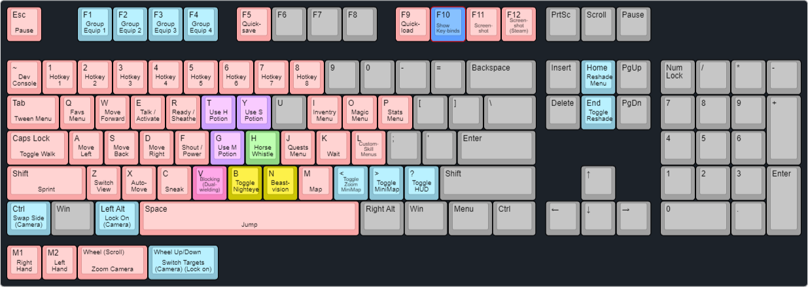

# Tales from the Northern Lands

## Table of Contents

- [Tales from the Northern Lands](#tales-from-the-northern-lands)
  - [Table of Contents](#table-of-contents)
  - [Preamble](#preamble)
  - [Modlist](#modlist)
  - [Screenshots](#screenshots)
  - [Installation](#installation)
    - [Required Accounts](#required-accounts)
    - [Pre-Installation](#pre-installation)
      - [Installing Microsoft Visual C++ Redistributable Package](#installing-microsoft-visual-c-redistributable-package)
      - [Installing .NET 5.0](#installing-net-50)
      - [Steam Config](#steam-config)
        - [Game Location](#game-location)
        - [Disable the Steam Overlay](#disable-the-steam-overlay)
        - [Change Steams Update Behavior](#change-steams-update-behavior)
        - [Set the Game language to English](#set-the-game-language-to-english)
      - [Clean Skyrim](#clean-skyrim)
      - [Start Skyrim](#start-skyrim)
    - [Using Wabbajack](#using-wabbajack)
      - [Preparations](#preparations)
      - [Downloading and Installing](#downloading-and-installing)
        - [Manual Downloads](#manual-downloads)
        - [Problems with Wabbajack](#problems-with-wabbajack)
          - [Could not download x](#could-not-download-x)
          - [x is not a whitelisted download](#x-is-not-a-whitelisted-download)
          - [Wabbajack could not find my game folder](#wabbajack-could-not-find-my-game-folder)
          - [Windows is reporting that a virus has been detected](#windows-is-reporting-that-a-virus-has-been-detected)
  - [How to Launch Tales from the Northern Lands](#how-to-launch-tales-from-the-northern-lands)
  - [Updating](#updating)
  - [Controls](#controls)
  - [In-Game MCM Options](#in-game-mcm-options)
  - [Other Post Installation FAQ](#other-post-installation-faq)
    - [Ultrawide Options](#ultrawide-options)
    - [Tweaking the Game Settings](#tweaking-the-game-settings)
      - [Using the pre-configured ModOrganizer Profiles](#using-the-pre-configured-modorganizer-profiles)
      - [BethINI Method](#bethini-method)
    - [Zoomed in Display](#zoomed-in-display)
    - [Removing the Modlist](#removing-the-modlist)
  - [Credits and Thanks](#credits-and-thanks)
  - [Contact](#contact)
  - [Contributing](#contributing)
  - [Changelog](#changelog)
  - [Licenses](#licenses)

## Preamble

This is a visual and gameplay overhaul focused on running on old and new systems alike.
I myself use a GTX 950 2GB VRAM, a Ryzen 5 2400G, 24GB RAM, have the game installed on an SSD and get 48-78 FPS in the Performance Profile, 34-60 FPS in the Balanced Profile(I will play with this most of the time) and 15-28 FPS with the Default Profile (the one without an extra profile name). *All those FPS vales are with the ReShade on, if you turn it off ([see Controls](#controls)) you can gain between 5-15 FPS depending on the region and the weather.*

For the **visual overhaul** I tried to mimic the look of the "Tales of/from ..." Series, "The Wolf Among Us" and mainly "Borderlands" with their cell-shaded visuals. The visual overhaul I initially used to create this list [Artistic Skyrim Overhaul](https://www.nexusmods.com/skyrimspecialedition/mods/9111), was stylized in a for my taste way to reflective way but I liked the textures themself, so I have changed most of the normal maps of the textures I came around while testing this list. And thanks to NotSandwich on the WJ discord there are no reflecting textures anymore, due to an INI tweak he recommended. Now I am still using it as a baseline but moved on to using the still actively updating and expanding [Borderlands Style Overhaul by Kanjs](https://www.nexusmods.com/skyrimspecialedition/mods/58407), but without the ENB and my ReShade preset instead.

For the **gameplay** this list merges gameplay-changing mods mixed and chosen from different overhaul projects like the SimonRim or SkyRem mods. It also features an incredible amount of weapon-variations (different enchantments on similar weapons) and wearable-variations (again different enchantments on the same item) thanks to [Halgari's RPG Loot Patcher](https://www.nexusmods.com/skyrimspecialedition/mods/37736) in its new form found [here](https://github.com/Synthesis-Collective/HalgarisConsistentRPGLoot) and a new inventory overhaul created by me specifically for this list powered by [Noggog's Synthesis Tool](https://github.com/Noggog/Synthesis).

If you need a perfectly balanced list this 9999% isn't for you, I make sure that things work and that there are no big obvious exploits. I tried not to break the balance too much when I overhauled the way the inventory system worked, so I had to write code into the overhaul patcher to adjust the magic effects that affect those systems to keep it in line with my changes. But I won't micromanage Leveled Lists or nerf some of the crazy enchantments the generator will provide for this list. The end goal of this list is to be fun and not a challenge or torture. *(I removed only 2 enchantment types, bound weapon giving enchantments that had the risk of crashing the game when in NPC inventories, and press "wait" to get infinite money enchantments. Those are game-breaking issues in the literal and figurative way.)*

I used my other list [SME(FT) - Skyrim Modding Essentials (Fixes & Tools)](https://eziothedeadpoet.github.io/SME-FT-/) as a baseline to create this. If you are interested in building your own setup or want a vanilla list just with fixes to test your mods feel free to try it out. (I am no longer active)

## Modlist

The list of mods can be found on [LoadorderLibrary](https://loadorderlibrary.com/lists/tales-from-the-northern-lands).

## Screenshots

So I have created a page where you can share your screenshots of this list with others and I hope you can help me out or have fun sharing screenshots since I am not the best at taking nice-looking screenshots myself.
You can make screenshots using the `F11` key and find them in the `Screenshots` folder inside of the `Screenshots ! Racemenu Presets ! Game Generated` Mod.
I have moved all screenshots to this [page](SCREENSHOTSDISPLAY.md) to never be limited by the space on this overview and instructions page.
To learn how to share your screenshots check the [Contibutng](#contiuting) section of this guide.

## Installation

### Required Accounts

| Website |Comment | Mandatory |
|-|-|-|
| [Nexus Mods](https://users.nexusmods.com/register) | Premium highly recommended for automated and faster downloads. | Yes |
| [Vector Plexus](https://vectorplexus.com/register/) | A NSFW modding site, but the only source for the head mesh replacer used for Player Character Creation and the NPC Overhaul used. **Make sure to create an E-Mail account and do NOT use a social login, because WJ can't log you in if you use social login.** | Yes |
| [MEGA](https://mega.nz/register/aff=SarImJUJMEM) | Works without an account as well but logged in uses have slightly higher download bandwidth per day. | No |

### Pre-Installation

These steps are only needed if you install this Modlist for the first time. If you update the modlist, jump straight to [Updating](#updating).

#### Installing Microsoft Visual C++ Redistributable Package

I doubt you need to do this since you likely already have this installed. The package is required for MO2 and you can download it from [Microsoft](https://support.microsoft.com/en-us/help/2977003/the-latest-supported-visual-c-downloads). Download the x64 version under "Visual Studio 2015, 2017 and 2019".

**[Direct link](https://aka.ms/vs/16/release/vc_redist.x64.exe)**

#### Installing .NET 5.0

This is a needed dependency for mods used with this list.
So please make sure to install it to avoid any issues. Download the desktop app x64 AND the console app x64 versions from [Microsoft](https://dotnet.microsoft.com/download/dotnet/5.0/runtime).

**[Direct Link Desktop](https://download.visualstudio.microsoft.com/download/pr/1daf85dc-291b-4bb8-812e-a0df5cdb6701/85455a4a851347de26e2901e043b81e1/windowsdesktop-runtime-5.0.12-win-x64.exe) | [Direct Link Console](https://download.visualstudio.microsoft.com/download/pr/28b0479a-2ca7-4441-97f2-64a3d64b2ea4/9995401dac4787a2d1104c73c4356f4d/dotnet-runtime-5.0.12-win-x64.exe)**

#### Steam Config

##### Game Location

Make sure your game is **NOT** installed in a _common folder_ like your `Desktop`, `Downloads` or `Program Files` folder (like the default steam location). If you only have one drive and can't create a second steam library with steam use LostDragonist's [steam-library-setup-tool](https://github.com/LostDragonist/steam-library-setup-tool/wiki/Usage-Guide) to create a second one on your main drive. When you have a new steam library setup move your game there **using the steam feature** to do so.

*Creating a new library with Steam:*

*Moving the Game:*

##### Disable the Steam Overlay

The Steam Overlay can cause issues with ENB and is recommended to be turned off when using and ENB, this list only uses ReShade which makes this step only necessary if you want to add an ENB yourself.

Open the Properties window (right-click the game in your Library->Properties), navigate to the _General_ tab, and un-tick the _Enable the Steam Overlay while in-game_ checkbox.

##### Change Steams Update Behavior

SSE is still being updated by Bethesda (they only add Creation Club content). Whenever the game updates, the entire modding community goes silent for the next one or two weeks because some mods need to be updated to the latest game runtime version.

To ensure that Steam does not automatically update the game for you, head over to the Properties window, navigate to the _Updates_ tab and change _Automatic updates_ to _Only update this game when I launch it_. You should also disable the Steam Cloud while you're at it.

##### Set the Game language to English

Just do it. This entire Modlist is in English and 99% of all mods you will find are also in English. I highly recommend playing the game in English and **I can not give support to people with a non-English game**.

Open the Steam Properties window, navigate to the _Language_ tab and select _English_ from the dropdown menu.

#### Clean Skyrim

I highly recommend uninstalling the game through Steam, deleting the game folder, and reinstalling it. You should also clean up the `Skyrim Special Edition` folder in `Documents/My Games/` by deleting the contents in it.
But verifying your installation via steam should be enough, if the installation fails follow the steps above.

How to verify Skyrim Special Edition with Steam:

- Open your Steam Library tab
- Right-click Skyrim Special Edition
- Select Properties
- Select Local Files
- Select Verify Integrity of Local Files

#### Start Skyrim

After you have done everything above and got a clean Skyrim Special Edition installation, start the Launcher and let it do the initial graphics check. Do not worry about this part as the installation will replace these graphics settings.
Start the game and exit once you're on the main menu.

### Using Wabbajack

#### Preparations

Grab the latest release of Wabbajack from [here](https://www.wabbajack.org/#/) and place the `Wabbajack.exe` file in a _working folder_. This folder **must not** be in a _common folders_ like your `Desktop`, `Downloads` or `Program Files` folder. It's best to create a Wabbajack folder near the root level of your drive like `C:/Wabbajack`.

#### Downloading and Installing

The download and installation process can take a very long time depending on your system specs. Wabbajack will detect the optimal amount of threads at the beginning of the installation. To have the highest amount of threads and thus the fastest speed, it is advised to have the working folder on an SSD.

1. Select a folder for all the mods that need to be downloaded somewhere that is not affected by UAC (Please do not put it in Documents, Program Files, Desktop. Put it somewhere easy like `C:/Modlists/Tales from the Northern Lands/downloads` or `Modlists/Downloads`).
2. Download all the mods [here](#manual-downloads) manually and put them in the folder created in step 1 (The reason for this is, that mods hosted on mega are prone to cause issues when installing and compiling modlists, and the manual download step for them during the installation sometimes doesn't work or some files are just too big so they are likely to fail because of that and I had better chances of success downloading those files manually.).
3. Open Wabbajack
4. Click on the settings icon and log in with your Nexus Mods and Vector Plexus Account. (Optionally MEGA as well.)
5. Click on `Browse Modlists`, and download Tales from the Northern Lands from the gallery.)
6. Once the download is done set the Installation folder to somewhere that is not affected by UAC (Please do not put it in Documents, Program Files, Desktop. Put it somewhere easy like `C:/Modlists/Tales from the Northern Lands`). The downloads path should be the one you created in step 1.
7. Click the Go/Begin button
8. Wait for Wabbajack to finish
[Post-Installation](#how-to-launch-tales-from-the-northern-lands)

##### Manual Downloads

It is absolutely required to manually download the files coming from MEGA, but the Nexus Mods files are only linked here, because they are likely to cause issues because of their size. The Vector Plexus File is listed for those that can't login to VP due their account being created with a social login.

| Host       | Mod                                    | Author                                                                           | Website                                                              | Download                                                                                              |
|------------|----------------------------------------|----------------------------------------------------------------------------------|----------------------------------------------------------------------|-------------------------------------------------------------------------------------------------------|
| MEGA       | Smooth Jump Stagger Animation          | [Smooth aka Skypia](https://www.nexusmods.com/skyrimspecialedition/users/433905) | [Website](https://smooths.tistory.com/23)                            | [Direct Download](https://mega.nz/file/5PxWBQga#jGc-JE1u8_QiZPnWNLIXvXKRNWgp1oTW3sgqTHY5eV8)          |
| MEGA       | Extra Drawing Nemesis Free SE          | [Smooth aka Skypia](https://www.nexusmods.com/skyrimspecialedition/users/433905) | [Website](https://smooths.tistory.com/44)                            | [Direct Download](https://mega.nz/file/YKZAGDqZ#f2U6xmdd6mNFvN1XFQOYSxQpIbztDWWGYNfOf9jEpxk)          |
| MEGA       | Smooth Combat Animation by Skill Level | [Smooth aka Skypia](https://www.nexusmods.com/skyrimspecialedition/users/433905) | [Website](https://smooths.tistory.com/18)                            | [Direct Download](https://mega.nz/file/4TJVGKjb#fLIBqEXkiV0g5SPuPtyrxqTi-HUai-S80sxOqj9r19w)          |
| MEGA       | Smooth DAR Combat Dodge                | [Smooth aka Skypia](https://www.nexusmods.com/skyrimspecialedition/users/433905) | [Website](https://smooths.tistory.com/24)                            | [Direct Download](https://mega.nz/file/YGZHgaKY#nooCozaPDHlY2XAdrCbod4-frgSQGbVsBkSX-zgAqrc)          |
| Nexus Mods | Cleaned Skyrim SE Textures             | [Kartoffel](https://www.nexusmods.com/skyrimspecialedition/users/6129887)        | [Website](https://www.nexusmods.com/skyrimspecialedition/mods/38775) | [Direct Download](https://www.nexusmods.com/skyrimspecialedition/mods/38775?tab=files&file_id=248251) |
| Nexus Mods | Unofficial High Definition Audio Project | [sharrken](https://www.nexusmods.com/skyrimspecialedition/users/4158519) | [Website](https://www.nexusmods.com/skyrimspecialedition/mods/18115) | <li>[Direct Download Voices EN Part 1](https://www.nexusmods.com/skyrimspecialedition/mods/18115?tab=files&file_id=57972)</li><li>[Direct Download Voices EN Part 2](https://www.nexusmods.com/skyrimspecialedition/mods/18115?tab=files&file_id=57857)</li> |
| Nexus Mods | Kanjs - Borderlands Style Anniversary Edition Mega Pack | [Kanjs](https://www.nexusmods.com/skyrimspecialedition/users/4685594) | [Website](https://www.nexusmods.com/skyrimspecialedition/mods/60023) | [Direct Download](https://www.nexusmods.com/skyrimspecialedition/mods/60023?tab=files&file_id=248844) |
| Vector Plexus | High Poly Head | KouLeifoh | [Website](https://vectorplexus.com/files/file/283-high-poly-head/) | You need to get `High_Poly_Head_v1.4_(SE).zip`|

##### Problems with Wabbajack

There are a lot of different scenarios where Wabbajack will produce an error. I recommend re-running Wabbajack before posting anything. Wabbajack will continue where it left off so you lose no progress.

###### Could not download x

If a mod got updated and the old files got deleted, it is impossible to download them. In this case, just wait till I update the modlist.

###### x is not a whitelisted download

This can happen when I update the modlist. Check if a new update is available and wait if there is none.

###### Wabbajack could not find my game folder

Wabbajack will not work with a pirated version of the game. If you own the game on Steam, go back to the [Pre-Installation](#pre-installation) step. If you own the game make sure you did [start Skyrim once](#start-skyrim).

###### Windows is reporting that a virus has been detected

Windows 10 has started to auto-quarantine the usvfs_proxy_x86.exe file from the latest version of Mod Organizer 2 saying a threat was detected. This is a known false positive confirmed by the MO2 Devs. You can fix this by adding an exemption for MO2 Folder to your Antivirus. An example for windows defender can be found [here](https://www.thewindowsclub.com/exclude-a-folder-from-windows-security-scan).

## How to Launch Tales from the Northern Lands

Head over to the installation folder and locate an executable named `ModOrganizer.exe` and launch it. Once it's launched there will be a dropdown box on the top right and a big run button next to it. Ensure it is set to SKSE by selecting it in the dropdown box and then hitting the run button. Under the run button, you can find a shortcut menu that allows you to make a desktop shortcut.

*If the game doesn't launch correctly check [this](#windows-is-reporting-that-a-virus-has-been-detected) and the [pre-installation steps](#pre-installation) as those are the solution for the most common issues besides an failed installation.*

## Updating

If this Modlist receives an update please check the Changelog before doing anything. Always backup your saves or start a new game after updating.

**Wabbajack will delete all files that are not part of the modlist when updating!**

Additionally installed mods will be removed.

Updating is like installing. You only have to make sure that you select the same path and tick the _overwrite existing Modlist_ button. Make sure to do backups of your saves in case anything goes wrong.

## Controls

[click here to create your own cheat-sheet, if you plan to change them.](http://www.keyboard-layout-editor.com/#/gists/bfbca895e59a1682798b219aec3db158)

## In-Game MCM Options

Pre-configured.

## Other Post Installation FAQ

### Ultrawide Options

Enable the mods in the `21x9 Patches` category in ModOrganizer.
**I can't and won't guarantee that any widescreen resolution will work flawlessly. And want to stress that the intended way of play is standard widescreen 16:9.**

### Tweaking the Game Settings

#### Using the pre-configured ModOrganizer Profiles

To use my pre-configured settings you can select the different profiles in ModOrganizer. **Just keep in mind that your saves are tied to their profile.**

1. Profile Quick-select.
2. Profile Menu.
   - It has options to transfer your saves.

#### BethINI Method

*Settings tweaked this way will be reverted after updates.*

- To change the quality settings:
  - Locate the `BethINI.exe` in `...\\(name of the MO 2 folder(the installation path you choose for the modlist))\tools\BethINI (ONLY LAUNCH WITH MO AND THE GAME CLOSED)` and run it with the game and MO2 closed.
    - In there (BethINI) go to the `Setup` tab and point BethINI to your `ModOrganizer.EXE`. (The place the list is installed in.)
    - Select the Profile you intend to use in the INI Path section (Either the Normal one or the `Basics` one).
    - Select a Preset fitting your Hardware.
    - Save and Exit

I recommend tweaking the `Detail` section for more FPS(If nothing else worked):

- `Shadow Resolution`: Very big one. A good balance is `2048` which is the borderline between high FPS drainage and garbage-looking shadows.
- `Ambient Occlusion`: Highly recommended to turn either this or your ENB version off (if you decided to use one). Do not have the game AO and an ENB AO turned on at the same time.
- `Remove Shadows`: If you really struggle, use this. This will disable all Shadows (not recommended)

### Zoomed in Display

This can be caused by Window's Display Scaling feature. This usually is set to above 100% when using very large (32 inch++) sized monitors and TVs. There are two solutions to this

- Set the display scaling back to 100% in the Screen Resolution Settings for Windows
- Edit the mod SSE Display Tweaks.
  - Under `[Render]`
    - Set Fullscreen to `True`
    - Set Borderless to `False`

### Removing the Modlist

You can just remove the MO2 folder and be done with it.

## Credits and Thanks

- YOU for reading the readme. Thanks a ton!!
- Xanza for writing A LOT of this for his modlist.
- ForgottenGlory for making SME(FT) and this modlist possible due to his early support. 🧡
- Thanks to NotSandwich on the Wabbajack Discord for sharing some awesome .ini edits that killed all unwanted reflections.🥪
- Everyone who was giving me feedback on the artistic choices.
- the creator of ReShade with its generous [License](ReShade/RESHADELICENSE.md#reshade-license) that allows me to include it.
- erri120 & jdsmith2816 - Repository template
- Halgari and everyone on the WJ Team
- Noggog and Halgari for making the large variety in weapons and Armor possible, by making the Mutagen Framework and the 1st iteration of the RPG Loot patcher respectively.
- The team behind the Artistic Skyrim Overhaul for inspiring me to make this because of its very distinctive unique style.
- Kanjs for reviving the spirit of art-driven Skyrim Texture Overhauls.
- Nem aka. Eggy aka. Osmosis-Wrench and JanuarySnow for both helping me make some custom edits to a few mods used in this list.
- ALL the mod authors that made the mods featured in this list.
- Special thanks to all the other people listed [here](https://eziothedeadpoet.github.io/AboutMe/HALLOFFAME.html) that support(ed) this and other projects of mine.

## Contact

While I'm nearly always available on the [Wabbajack Discord](https://discord.gg/wabbajack), I would advise checking the [Issues](https://github.com/EzioTheDeadPoet/Tales-from-the-Northern-Lands/issues) (open **and** closed ones) on GitHub and the pinned messages in the dedicated channel for this list on the Wabbajack server first if you have any problems.

**I WILL NOT PROVIDE SUPPORT FOR YOU IN DMs.**

**DO NOT CONTACT MOD-AUTHORS WITH ISSUES!!**

## Contributing

See [How to contribute](HOWTOCONTRIBUTE.md).

## Changelog

See [Changelog](CHANGELOG.md).

## Licenses

- [ReShade License](ReShade/RESHADELICENSE.md)

---
